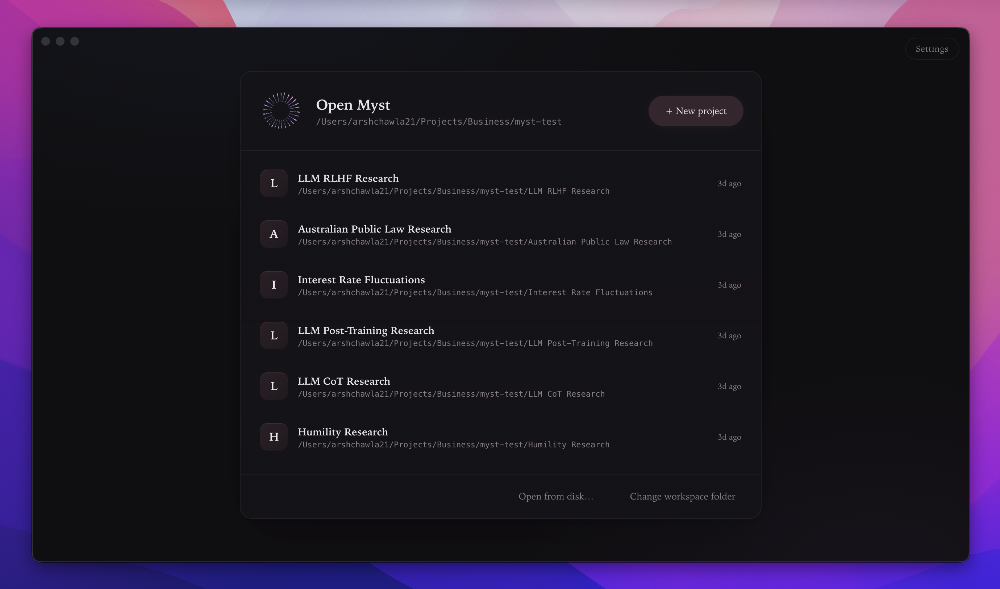
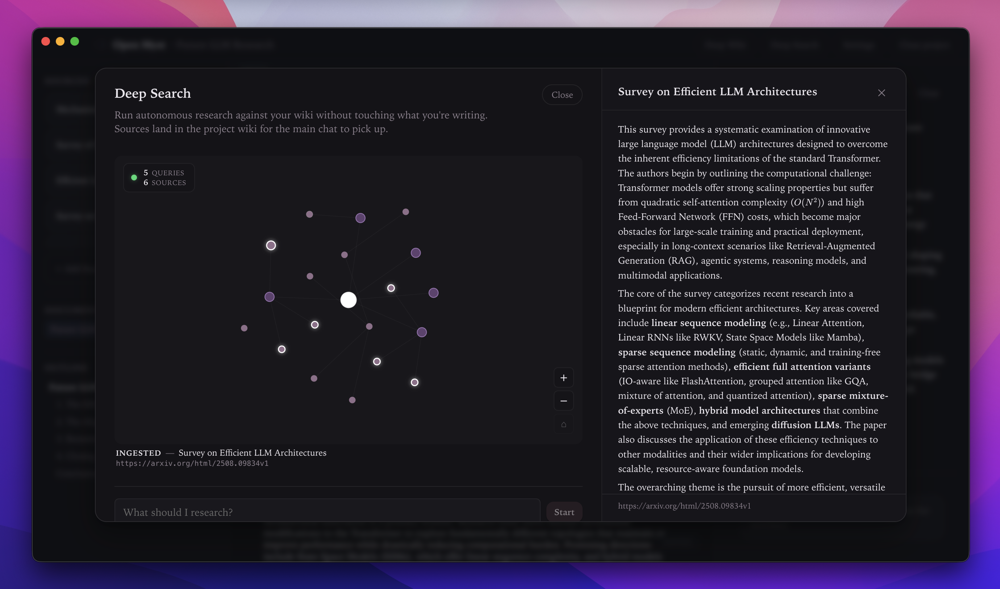
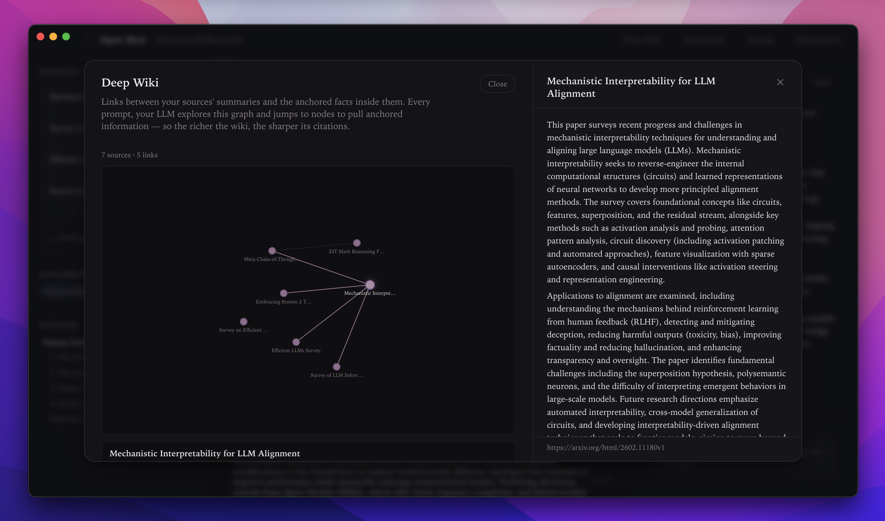
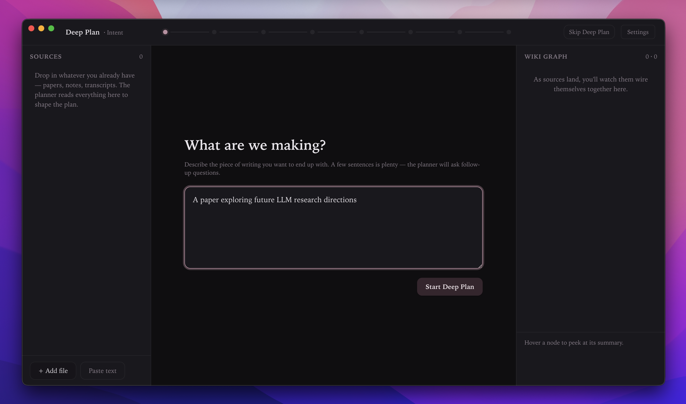
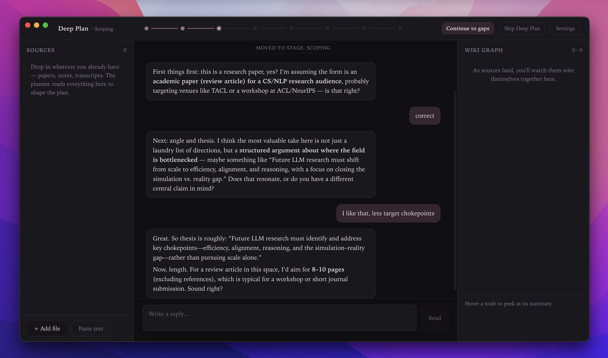
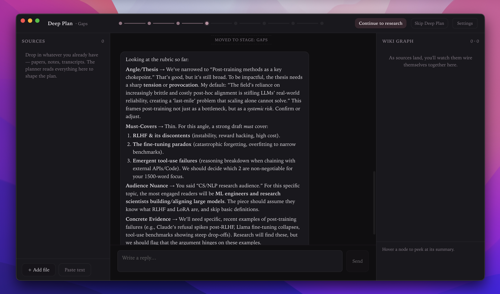
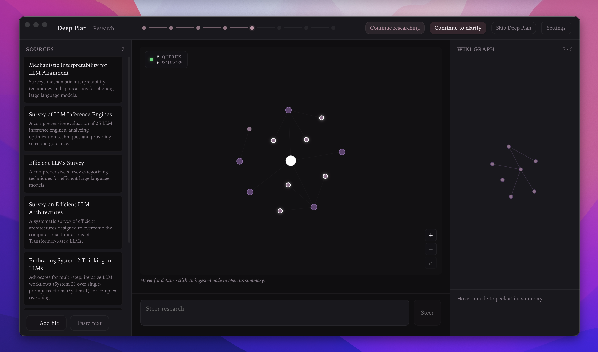
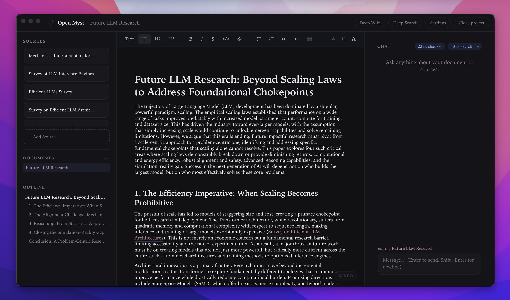
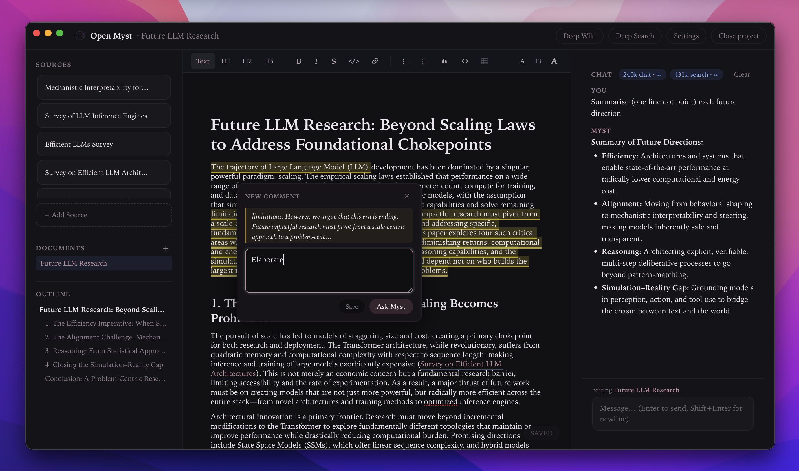

# OpenMyst
[OpenMyst](openmyst.ai) is a research collaboration tool, built using enterprise grade open source tools and ideas.



A desktop writing and research companion. You write in a markdown editor; an LLM agent reads alongside you, maintains a grounded research wiki on disk, and proposes edits as inline diffs you accept or reject one at a time. The wiki is plain files — drop in PDFs, code, data, or links, and the agent consults it every turn.

> **Status: early.** The core loop (plan → research → write → cite) works end-to-end and is what we use day-to-day. Open-sourcing now to find collaborators who want to push the "agent that knows your project" idea further.

---

## Deep Search

Hand it a research task and walk away. Deep Search proposes a handful of well-shaped web queries, fetches the top results through Jina, filters out bot-blocks and paywalls, and digests each survivor into your wiki — summarised, anchor-indexed, and ready to cite. No chat, no drafts. Just sources landing one by one while you watch the graph light up.

It's **steerable mid-run**: add a hint (*"focus on post-2022 papers, skip blog posts"*) and the next batch of queries bends toward it. The planner is tuned for librarian-style broad terms over quoted-phrase keyword stuffing, which means fewer zero-result failures and fewer wasted tokens. Caps at 8 ingested sources by default — coverage is usually good by then, and you can re-run anytime to go deeper.



---

## Deep Wiki

The wiki is your project's long-term memory. Every source you add — PDF, markdown, pasted article, link, or a raw code/data file — gets summarised and indexed into `.myst/wiki/`. Deep Wiki renders that as a **force-directed graph** of source-to-source links inferred from the summary text (no embeddings, no vector DB, just inverted-index on terms). Click any node and the full detailed summary slides in alongside it.

What makes this load-bearing: **every chat turn loads the wiki index as the agent's default memory surface**. When a source looks relevant, the agent drills in with a deterministic `source_lookup` protocol — pulling the *verbatim* passage for a specific anchor (definition, equation, quote) straight off disk. It never paraphrases from memory. Raw files (`.py`, `.csv`, `.json`) bypass summarisation entirely and are read on demand when the task calls for them.



---

## Deep Plan

A full pre-writing phase that turns a vague intent into a cited first draft. Deep Plan runs as a staged interview: **intent → sources → scoping → gaps → research → clarify → review → draft**. Every question is opinionated — the planner states a default it thinks is right, and you confirm or push back. You're never staring at an empty form.

**Intent.** Describe what you're making in a few sentences. That's all it needs to start.



**Scoping.** The planner interviews you to fill in a rubric — form, audience, length, thesis. Every reply updates the rubric in place, and the rubric persists across app restarts, so a session you start Monday is still there Friday.



**Gaps.** Before burning tokens on research, the planner audits what the rubric is missing — thin angles, unstated tensions, must-cover claims the draft will need evidence for. You confirm the framing; only then does research run.



**Research.** Deep Search fires autonomously against the gaps, steered by the rubric. You watch the graph grow in real time, and you can pause, steer, or re-run.



**Clarify → review → draft.** A final round of sharp questions, a plan summary with a built-in self-critique ("the weakest claim is…"), then a one-shot draft lands in the editor with inline citations pointing back at the exact wiki slug each claim came from.



---

## The writing surface

Once the draft is in the editor, the loop is: select text → comment → ask the agent to tighten, reframe, or extend it. The agent emits `myst_edit` blocks, rendered as red strike-throughs + green replacements you accept or reject without leaving the page. Edits are staged on disk (`.myst/pending/<doc>.json`), so a crash never loses an in-flight proposal, and you can iterate on an unaccepted edit (*"make it shorter"*) until it's right.



## What else it does

- **Grounded citations.** Every factual claim in a generated draft links to the exact source in your wiki. Click through and you land on the verbatim passage — not a plausible reconstruction.
- **Source types.** PDFs, markdown, pasted text, links (fetched + converted to markdown via Jina Reader), and raw files (`.py`, `.csv`, `.json`, `.tsv`) that skip summarisation and are read on demand.
- **Model choice.** In managed mode you pick from a curated set of strong low-cost models (DeepSeek V3.2, Gemini 2.5 Flash Lite, GPT-OSS 120B, GLM 4.5 Air). In BYOK mode, any OpenRouter model. Keys are encrypted at rest via the OS keychain.
- **Plain files on disk.** Every project is a folder of markdown and JSON — version it with git, sync it with Dropbox, grep it with ripgrep. Nothing is locked away in a database.
- **Multi-project workspace.** One workspace root, many projects, recent-project picker on launch.

## Quick start

```bash
git clone https://github.com/openmyst-ai/openmyst
cd openmyst
npm install
npm run dev
```

The Electron window opens. Choose **Create new project** to scaffold a fresh folder, add your OpenRouter key in Settings (top-right), pick a model, and you're live. The project folder is plain markdown + JSON.

Prefer a managed build (no BYOK, model + search routed through openmyst.ai)? Run `npm run dev:prod`. See [CONTRIBUTING.md](CONTRIBUTING.md) for the full BYOK vs. managed split.

## How the project is laid out

```
src/
  main/        Node + Electron main process — IPC, filesystem, LLM calls
    features/  Feature modules: chat, sources, wiki, deepPlan, deepSearch, research…
    platform/  Thin wrappers over fs/log/window — the only place features touch Node primitives
    llm/       Facade over OpenRouter (BYOK) and the openmyst.ai relay (managed)
    ipc/       IPC handlers, one file per feature
  preload/     contextBridge exposing typed IPC to the renderer
  renderer/    React + Tiptap UI
  shared/      Types and IPC channel constants used by all three
docs/          Developer documentation — start here if you want to contribute
```

Each feature in `src/main/features/` is self-contained: pure logic, IO helpers from `platform/`, an `index.ts` barrel, and an IPC handler in `src/main/ipc/<feature>.ts`. See [docs/adding-a-feature.md](docs/adding-a-feature.md).

## Documentation

- [docs/architecture.md](docs/architecture.md) — process model, feature-folder layout, how the layers fit together
- [docs/data-model.md](docs/data-model.md) — what lives in a project folder on disk
- [docs/llm-layer.md](docs/llm-layer.md) — the BYOK / managed facade and how to call it
- [docs/chat-turn.md](docs/chat-turn.md) — what happens between "user hits send" and "assistant message appears"
- [docs/editing-pipeline.md](docs/editing-pipeline.md) — `myst_edit` blocks, pending queue, accept/reject, fuzzy matching
- [docs/wiki-system.md](docs/wiki-system.md) — sources, wiki index, graph, `source_lookup`
- [docs/adding-a-feature.md](docs/adding-a-feature.md) — step-by-step recipe
- [docs/development.md](docs/development.md) — scripts, tests, debugging, releasing

## Contributing

See [CONTRIBUTING.md](CONTRIBUTING.md). Short version: open an issue first if it's a bigger change, keep PRs focused, run `npm run typecheck && npm test` before pushing, and read [docs/architecture.md](docs/architecture.md) before touching anything in `src/main/`.

## License

See [LICENSE](LICENSE)
