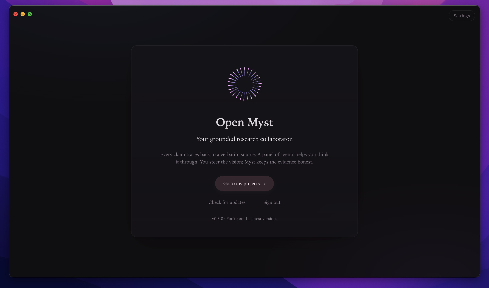
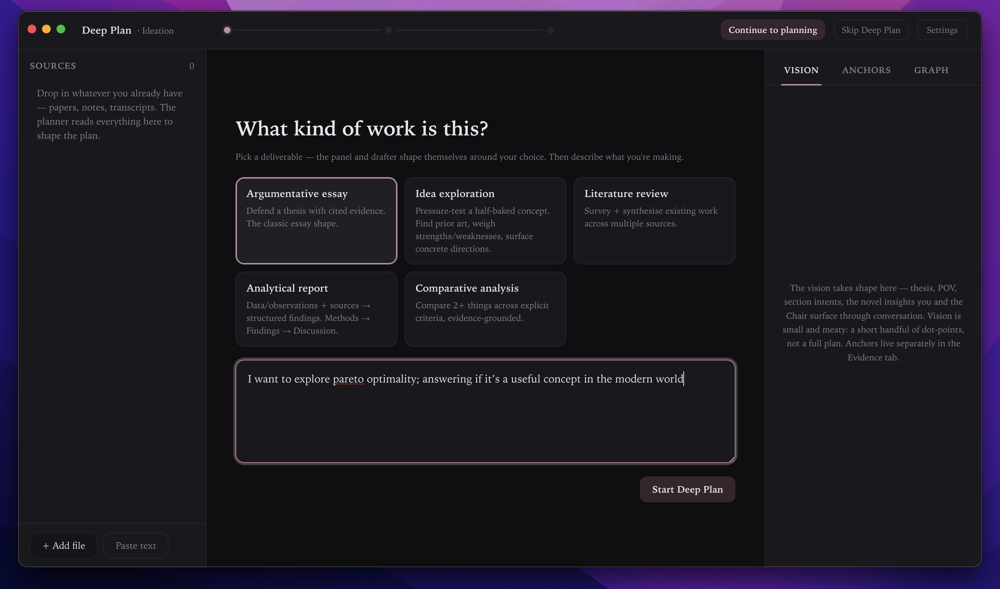
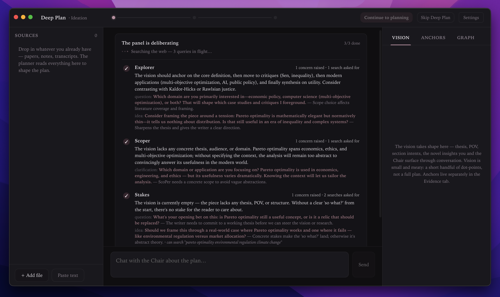
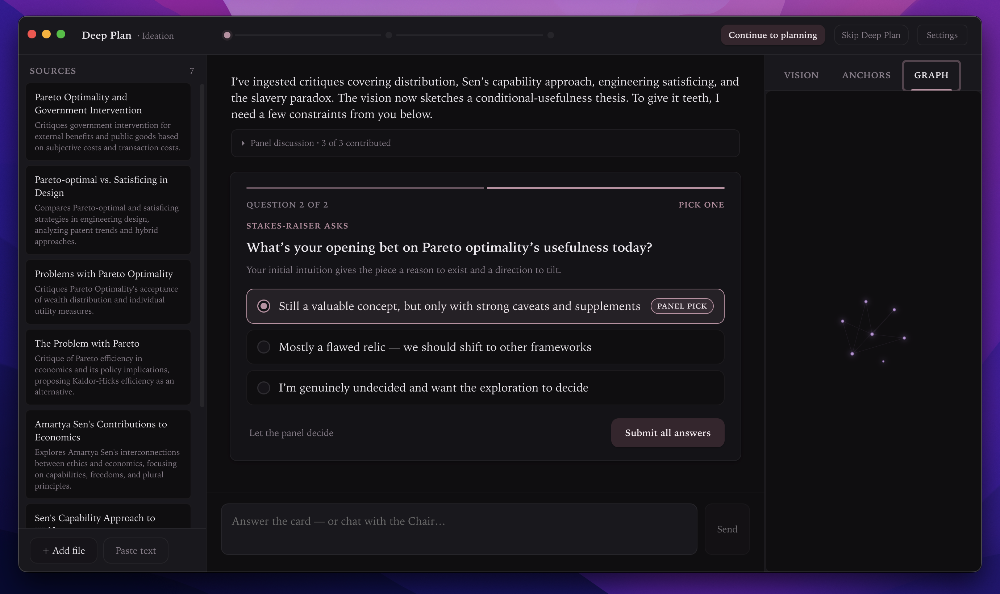
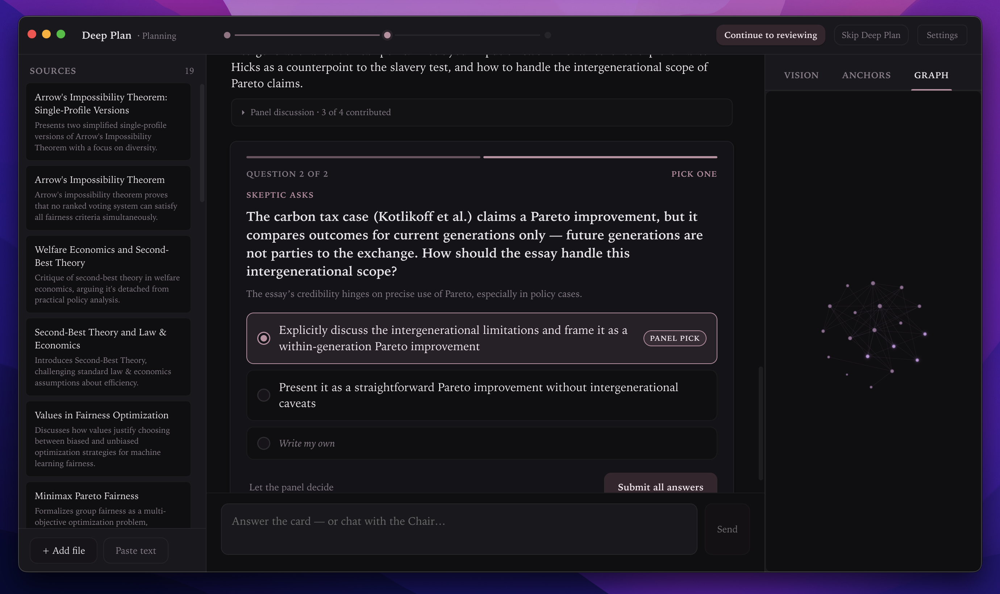
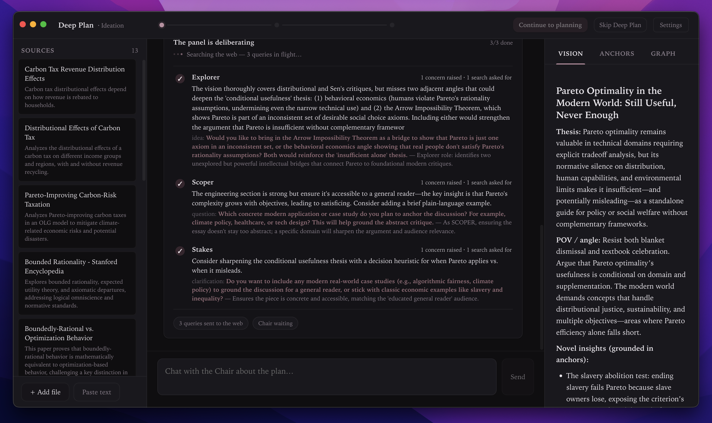
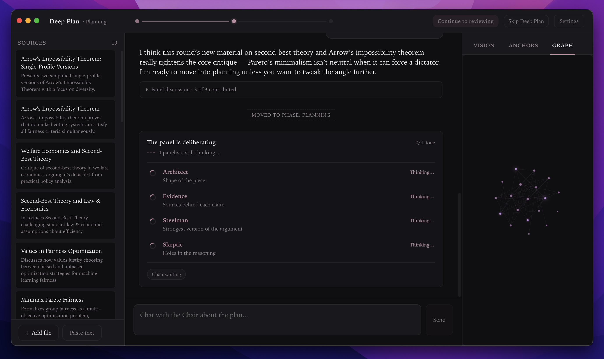
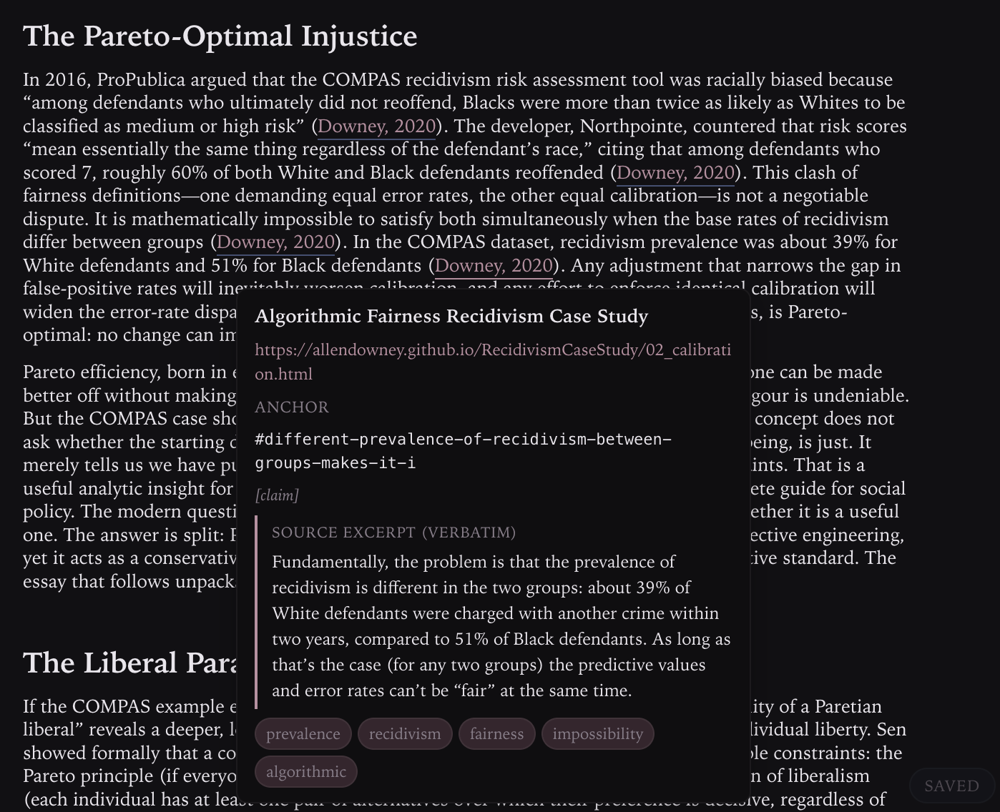
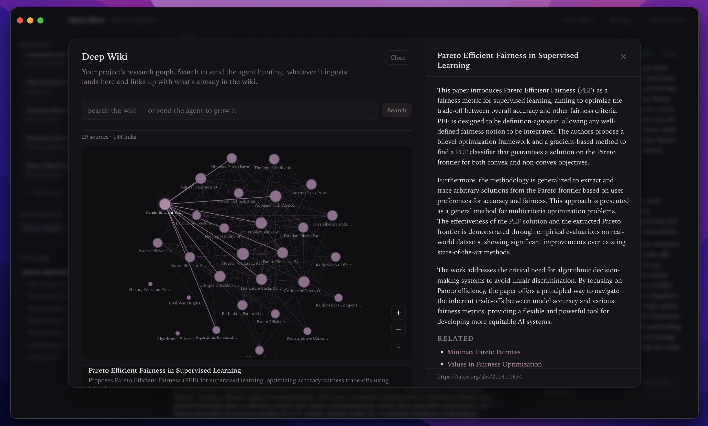

# OpenMyst

[OpenMyst](openmyst.ai) is a research collaboration tool — a desktop companion for ideation, essay-writing, literature review, and data analysis where every claim is grounded in a source you uploaded.



You hand it a half-baked idea, an essay topic, a stack of papers, or a dataset. A panel of role-specific agents reads it from different angles, asks you the questions only you can answer, autonomously fetches the literature it needs, and assembles a `vision.md` — the intellectual spine of the piece. When you're ready, a stronger drafter writes the full text from the vision, citing every factual claim back to a verbatim line in your sources.

> **Status: early.** The end-to-end loop (panel → questions → research → vision → draft) works and is what we use day-to-day. Open-sourcing now to find collaborators who want to push the "research collaborator that grounds everything in your sources" idea further.

---

## Philosophy

Three convictions sit underneath every design choice:

**1. Open-source models are catching up — fast.** Frontier-quality reasoning is now available in models that cost cents per million tokens (DeepSeek V4, Gemma 4, Gemini Flash). Picking a model isn't the differentiator anymore; almost any modern model can write competent prose. So OpenMyst hard-codes its model choices and stops asking you to fiddle with them.

**2. The bottleneck has moved to context — which means humans matter more, not less.** When the model is no longer the limit, the limit is *what's in front of it*. The right framing, the right sub-questions, the right corner of the literature, the angle only the writer can see. So OpenMyst leans hard into multi-agent ideation: a panel of 11 role-specific agents (Explorer, Skeptic, Steelman, Architect, Adversary, Audience…) each interrogates your work through their own lens, and a strong-model Chair surfaces the questions only *you* can answer. The user isn't a passenger — the user is the most important factor for getting a novel output out of an LLM, and the panel is built to extract their judgement, not bypass it.

**3. Anchored sources, no hallucination.** A research tool that fabricates citations is worse than no tool at all. So every source you ingest gets parsed at index time into *anchors* — verbatim snippets tagged as definitions, claims, statistics, quotes, or findings. The drafter can ONLY cite anchors that exist on disk. Every inline citation in a generated draft links back to the exact line of the exact source it came from. When you hover a citation, you see the source's actual words, not a paraphrase. This is the load-bearing rule: no anchor, no claim.

---

## Deep Plan — multi-agent ideation + drafting

Deep Plan is the heart of OpenMyst. You pick a deliverable mode, describe what you're making, and the system runs a structured pre-writing loop: **panel deliberates → questions surface → you answer → vision sharpens → repeat → drafter writes the full piece**.

**Modes.** Argumentative essay, idea exploration, literature review, analytical report, comparative analysis. Each mode reshapes the panel's behaviour and the drafter's output structure. Idea exploration, for example, doesn't manufacture a thesis — it surveys prior art, surfaces strengths and weaknesses, and proposes concrete directions. The drafter writes a "concept workshop" document, not an essay.



**The panel deliberates.** Each round, role-specific cheap-model agents read the current vision and produce three outputs: a private vision-note for the Chair, autonomous searches when the literature has gaps, and user-prompts they want the writer to weigh in on.



**Questions surface with attribution.** The Chair selects the sharpest 2–3 panel prompts each round and surfaces them with role attribution — "Skeptic asks…", "Adversary asks…". The user sees concrete provenance instead of a faceless committee.



**Source-driven probing.** Panelists don't just propose new ideas — they cross-examine the writer against the wiki itself. When an existing anchor creates tension with the vision, the panel raises it as a prompt: *"X (already in your wiki) says Y — does that change your stance?"*



**Vision.md grows.** After each round, the Chair sharpens the vision: thesis, POV, novel insights, the counter-argument to engage, what the piece argues against, a section arc. The vision is the writer's intellectual spine — small, dense, the source of truth the drafter consumes.



**Phase advance.** Three phases — ideation → planning → reviewing → done. The Chair signals when each phase is ready; you hit Continue when you agree.



**One-shot draft.** When the vision is ready, a stronger drafter writes the full piece from vision + anchored evidence. Auto-continue rescues partial drafts on timeout — if the upstream stream drops mid-generation, the drafter resumes from where it stopped, transparently. Citations are inline Harvard format with the underlying anchor link in the href.

---

## Anchored sources — the no-hallucination contract

Drop a PDF, paste an article, link a URL, upload a CSV / .xlsx / code file. At ingest time:

- The summary model digests the source into a wiki page.
- It extracts **anchors** — typed, verbatim snippets (`definition`, `claim`, `statistic`, `quote`, `finding`).
- It pulls **bibliographic metadata** (author, year, title, journal, DOI, URL) from the title page or header.
- It tags the source as **reference** (cite it) or **guidance** (apply its method, never cite).

The drafter only cites anchors that exist. Each inline citation is a markdown link `([Author, Year](slug.md#anchor-id))` whose href fragment points to the exact anchor on disk. Hover any citation in the rendered draft and you see the verbatim source text.



Sources you can ingest:
- **PDFs, markdown, plain text** — summarised + anchor-indexed.
- **Pasted text** — same pipeline; useful for excerpts or articles you've already cleaned up.
- **Links** — fetched via Jina Reader, converted to markdown, summarised.
- **Spreadsheets** (`.xlsx`, `.xls`, `.ods`) — sheets flattened to markdown tables, agent reads on demand.
- **Raw files** (`.py`, `.csv`, `.json`, `.tsv`, etc.) — kept verbatim, agent reads via `source_lookup` when the task calls for them.

---

## Deep Wiki — your project's long-term memory

Every source you add lives in `.myst/wiki/`. Deep Wiki renders the union as a force-directed graph — sources connected by links the digest extracted between them (no embeddings, no vector DB, just inverted-index over terms). Click a node, the full summary slides in alongside.



The graph grows with the project — new sources slot into the existing structure as the panel and Deep Search find them.

The wiki index is the agent's default memory surface on every chat turn. When a source looks relevant, the agent emits a `source_lookup` block and gets the verbatim passage back — never paraphrasing from memory.

---

## Deep Search — autonomous research

Hand it a research task and walk away. Deep Search proposes well-shaped web queries (broad and librarian-style, not keyword-stuffed), fetches top results through Jina, filters out bot-blocks and paywalls, and digests each survivor into your wiki — summarised, anchor-indexed, ready to cite. Steerable mid-run with hints (*"focus on post-2022 papers, skip blog posts"*).

---

## The writing surface

Once a draft is in the editor, the loop is: select text → comment → ask the agent to tighten, reframe, or extend it. The agent emits `myst_edit` blocks rendered as red strike-throughs + green replacements you accept or reject without leaving the page. Edits stage on disk (`.myst/pending/<doc>.json`), so a crash never loses an in-flight proposal. You can iterate on an unaccepted edit (*"make it shorter"*) until it's right.

---

## What else it does

- **Hard-coded model assignments.** Source digest runs on Gemini 2.5 Flash Lite (cheap + reliable for structured JSON). Chat / Chair / panel run on DeepSeek V4 Flash. The drafter steps up to DeepSeek V4 Pro for the long output it needs. No model picker — picking a model isn't the value.
- **Five deliverable modes.** Argumentative essay, idea exploration, literature review, analytical report, comparative analysis. Each reshapes the Chair's vision template and the drafter's output structure.
- **Source roles.** Mark a source as `reference` (cite it inline + list in references) or `guidance` (apply its method, never cite — for framework guides, rubrics, style manuals).
- **User constraints carried through.** Word count, framework, deliverable format, audience — extracted from your brief, surfaced to every panel and Chair round, applied as hard constraints by the drafter.
- **Auto-continue on timeouts.** If the drafter's stream drops mid-generation (proxy timeout), the system replays with the partial draft and resumes — no lost tokens.
- **Plain files on disk.** Every project is a folder of markdown and JSON — version it with git, sync it with Dropbox, grep it with ripgrep. Nothing locked in a database.
- **Multi-project workspace.** One workspace root, many projects, recent-project picker on launch.

---

## Quick start

```bash
git clone https://github.com/openmyst-ai/openmyst
cd openmyst
npm install
npm run dev
```

The Electron window opens. Choose **Create new project** to scaffold a fresh folder, add your OpenRouter key in Settings (top-right), and you're live. The project folder is plain markdown + JSON.

Prefer a managed build (no BYOK, model + search routed through openmyst.ai)? Run `npm run dev:prod`. See [CONTRIBUTING.md](CONTRIBUTING.md) for the full BYOK vs. managed split.

## How the project is laid out

```
src/
  main/        Node + Electron main process — IPC, filesystem, LLM calls
    features/  Feature modules: chat, sources, wiki, deepPlan, deepSearch, research…
    platform/  Thin wrappers over fs/log/window — the only place features touch Node primitives
    llm/       Facade over OpenRouter (BYOK) and the openmyst.ai relay (managed)
    ipc/       IPC handlers, one file per feature
  preload/     contextBridge exposing typed IPC to the renderer
  renderer/    React + Tiptap UI
  shared/      Types and IPC channel constants used by all three
docs/          Developer documentation — start here if you want to contribute
```

Each feature in `src/main/features/` is self-contained: pure logic, IO helpers from `platform/`, an `index.ts` barrel, and an IPC handler in `src/main/ipc/<feature>.ts`. See [docs/adding-a-feature.md](docs/adding-a-feature.md).

## Documentation

- [docs/philosophy.md](docs/philosophy.md) — the longer version of the philosophy above
- [docs/architecture.md](docs/architecture.md) — process model, feature-folder layout, how the layers fit together
- [docs/data-model.md](docs/data-model.md) — what lives in a project folder on disk
- [docs/llm-layer.md](docs/llm-layer.md) — the BYOK / managed facade and how to call it
- [docs/panel-roles.md](docs/panel-roles.md) — the 11 cheap-model panelist personas + when each runs
- [docs/chat-turn.md](docs/chat-turn.md) — what happens between "user hits send" and "assistant message appears"
- [docs/editing-pipeline.md](docs/editing-pipeline.md) — `myst_edit` blocks, pending queue, accept/reject, fuzzy matching
- [docs/wiki-system.md](docs/wiki-system.md) — sources, wiki index, graph, `source_lookup`
- [docs/adding-a-feature.md](docs/adding-a-feature.md) — step-by-step recipe
- [docs/development.md](docs/development.md) — scripts, tests, debugging, releasing

## Contributing

See [CONTRIBUTING.md](CONTRIBUTING.md). Short version: open an issue first if it's a bigger change, keep PRs focused, run `npm run typecheck && npm test` before pushing, and read [docs/architecture.md](docs/architecture.md) before touching anything in `src/main/`.

## License

See [LICENSE](LICENSE).
